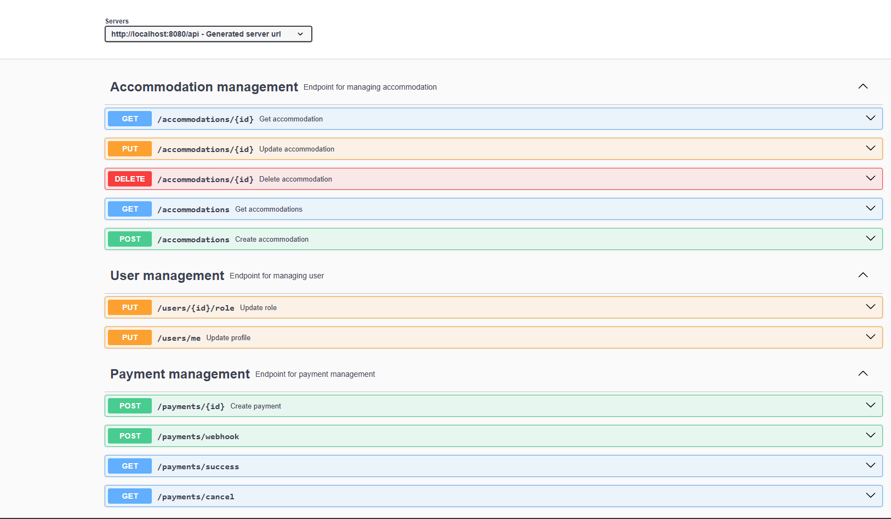
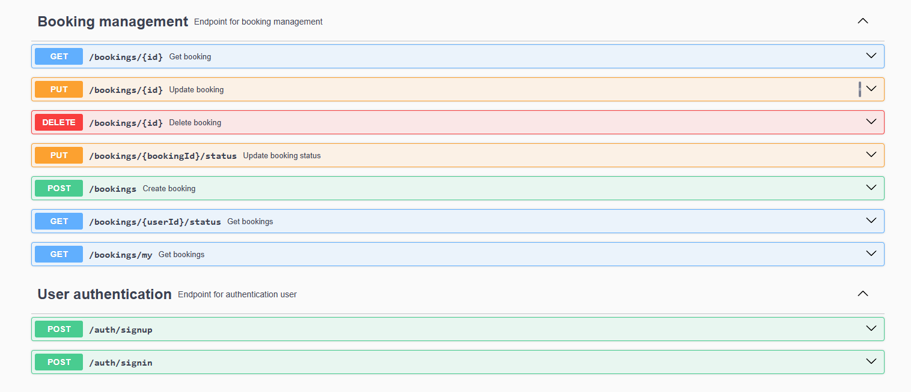

# 🏡 Booking System — Accommodation Reservation App
## 🔹 Вступ
Цей проєкт став для мене цікавим і корисним досвідом.
Ідея виникла після моєї останньої поїздки на відпочинок, де потрібно було бронювати місця через сторонню систему. Я подумав:

“А чому б не створити щось подібне самостійно?”

Так і з’явилась ця система — з можливістю реєстрації користувачів, створення житла, бронювання, онлайн-оплати та керування статусами.

## 🔹 Використані технології
Java 17

Spring Boot (Core framework)

Spring Security + JWT (автентифікація/авторизація)

Spring Web (REST API)

Spring Data JPA + Hibernate

Liquibase (для міграцій)

Docker (контейнеризація)

Stripe API (інтеграція онлайн-оплати)

Telegram Bot API (повідомлення користувачам)

Ngrok (для публічного доступу до локального webhook)

MapStruct (для мапінгу DTO ↔ Entity)

JUnit & Integration Tests (тестування)

## 🔹 Основні функціональні можливості
🔐 AuthController
POST /register — реєстрація нового користувача

POST /login — вхід у систему

👤 UserController
PUT /update-role — оновлення ролі користувача

PUT /update-profile — редагування профілю

🏠 AccommodationController
POST /accommodation — створення житла

GET /accommodations — перегляд усього житла

GET /accommodation/{id} — перегляд одного житла

PUT /accommodation/{id} — оновлення житла

DELETE /accommodation/{id} — видалення

📅 BookingController
POST /booking — створення бронювання

GET /bookings — перегляд броней за статусом

GET /bookings/me — перегляд броней поточного користувача

GET /booking/{id} — перегляд конкретної броні

PUT /booking/{id} — оновлення бронювання

PUT /booking/status/{id} — змінити статус

DELETE /booking/{id} — видалити бронь

💳 PaymentController
POST /payment — створити оплату через Stripe

Stripe webhook: автоматичне оновлення статусу після оплати

## 🔹 Як запустити проект
⚠️ Для коректного запуску потрібні:

Docker

Java 17

MySql (або контейнер з ним)

Ngrok акаунт (для webhook Stripe)

🔧 Кроки:
Клонувати репозиторій:

bash
Копіювати
Редагувати
git clone https://github.com/yourusername/booking-system.git
cd booking-system
Налаштувати .env або application.yml (API keys, DB, Stripe)

Запустити Docker-компоненти:

bash
Копіювати
Редагувати
docker-compose up
(Опційно) Запустити Ngrok:

bash
Копіювати
Редагувати
ngrok http 8080
Перейти за URL і протестувати API (наприклад, через Postman)

## 🔹 Важливі моменти та виклики
Навчився інтегрувати Stripe API разом із webhook — це було вперше.

Створив кастомну аутентифікацію з JWT.

Використовував MapStruct для зручного мапінгу DTO ↔ Entity.

Окрема увага — обробка ролей (admin/user), та безпечне оновлення профілю.

Telegram-бот налаштовано на повідомлення адміну про нові бронювання (асинхронно через Executor).

## 🔹 Postman Collection
Колекція запитів доступна у папці postman/.
Інструкція:

Відкрити Postman

Імпортувати файл

Оновити {{baseUrl}} на актуальний (http://localhost:8080 або ngrok URL)

## 🔹 Автор
Ім’я Прізвище
Telegram: @servetochka
GitHub: github.com/yourusername

## 🔹 Автор
Цей проєкт — мій повноцінний досвід розробки бекенду з нуля.
Мета — не просто зробити "чергову CRUD систему", а створити щось живе, з інтеграціями, безпекою, платежами та можливістю реального застосування.

!1) файл із Postman and translate in English and 